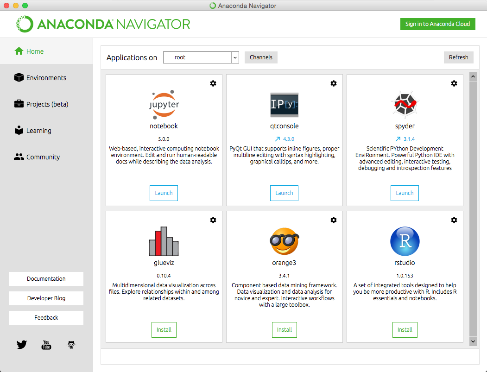
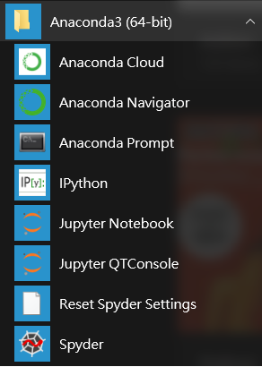
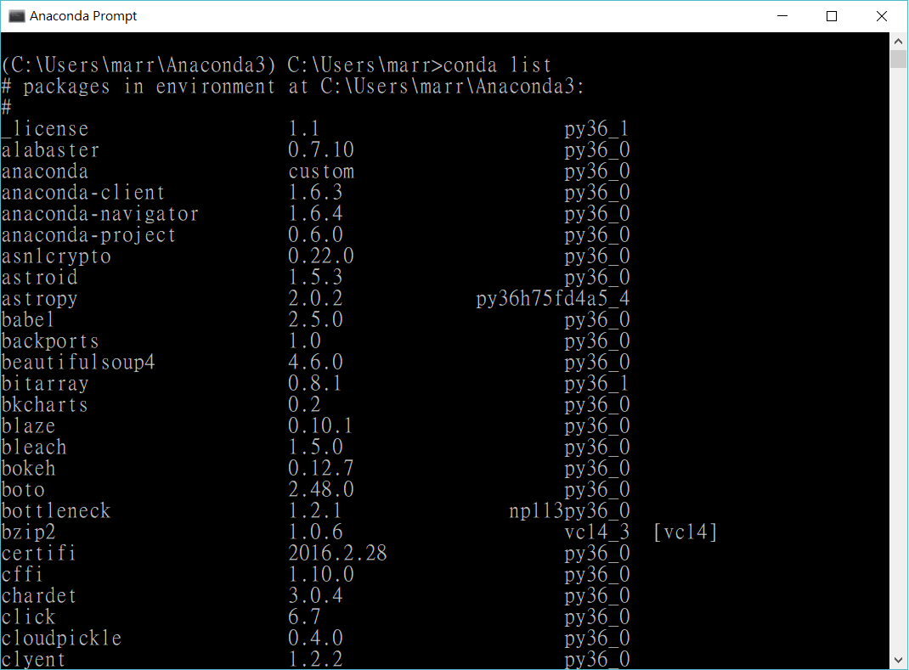
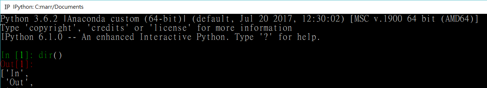
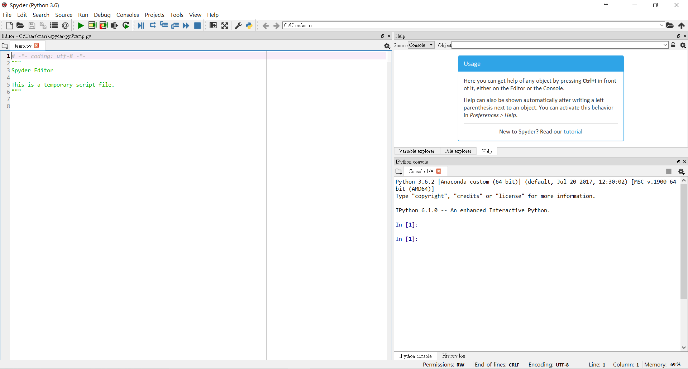
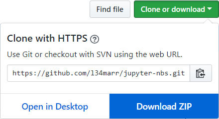
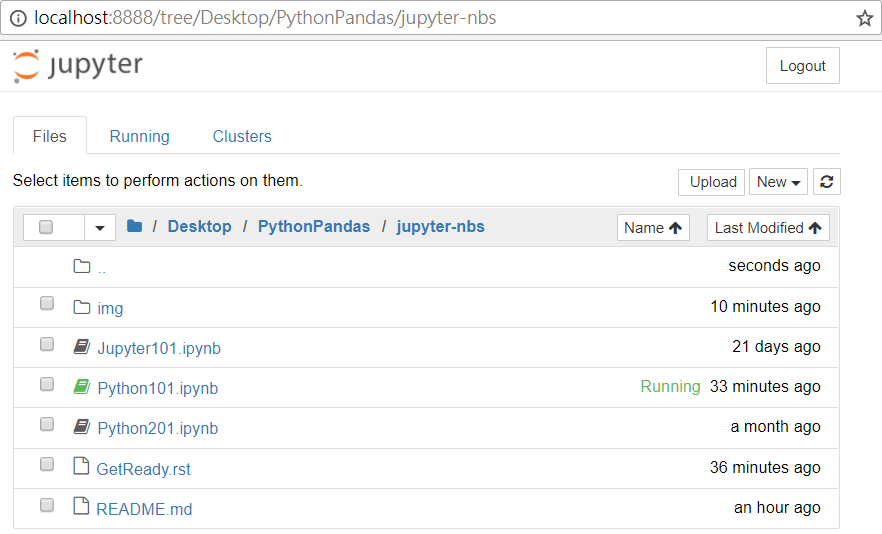
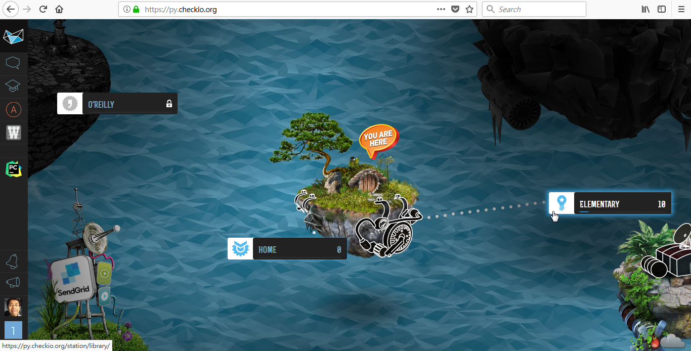
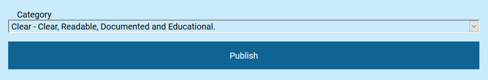

Anaconda: Friendly Python Platform
----------------------------------

`Steps to Install on Windows <http://docs.anaconda.com/anaconda/install/windows>`_

1. Download URL: http://www.anaconda.com/download
2. Choose the Installer for Your OS and CPU
3. Select an Install for "Just Me"
4. Install to a Directory Path that Does Not Contain Spaces or Unicode Characters
5. Ater the Install is Complete, Verify It by Opening **Anaconda Prompt** and Running the Command ``conda list``

Different Ways to Run Python
----------------------------

1. Interpreter from Console
2. IPython
3. Jupyter Notebook
4. IDE (Spyder)

* Note that ``>>>`` is the Default Python Prompt
* Type ``quit()`` to Exit the Python Interpreter

.. image:: img/start-cmd.png

GitHub: Collaboration Platform
------------------------------

Steps to Quick Download Your Handouts

1. Download URL: http://github.com/l34marr/jupyter-nbs
2. Find the **Clone or download** Dropdown Menu, Choose Dowload ZIP
3. Unzip the File
4. Use the **Jupyter Notebook App** to Open .ipynb Files

Steps to Install GitHub Desktop (Optional)

1. Download URL: http://desktop.github.com/
2. Choose the Installer for Your OS

Notebook: Executable Document
-----------------------------

* The Handouts are Edited with the **Jupyter Notebook App** and Allow You to Excute and Change on the fly.
* You can run the notebook document step-by-step (one cell a time) by pressing *Shift + Enter*

Steps to Open Jupyter Notebook and Run the Cells

1. (Windows) Start Menu / Jupyter Notebook
2. Browse to Locate Your Notebook Documents
3. Click to Select a Cell: Blue Cell Border means it is in Command Mode
4. One way to enter Edit Mode is pressing Enter
5. When a Cell is in Edit Mode (indicated by a Green Cell Border) You Can Type into the Cell
6. One way to quit Edit Mode is pressing Esc

.. image:: img/notebook-cell-color.png

CheckiO: Exercise and Classroom
-------------------------------

Steps to Solve Missions (Coding Puzzles)

1. URL: http://py.checkio.org/
2. Click "Start the Game" to Login
3. Some Easiest Missions are in the "Library Island" ("Elementary" Station)
4. Try First Mission at http://py.checkio.org/mission/say-history
5. Click "Solve It" to Show `the Editor <https://www.youtube.com/watch?v=3NOc3VXfvzI>`_
6. Click "Run" to See If Your Codes Working
7. Click "Check" When You Complete
8. Click "Publish" to Share Your Solution
9. Select a Category for Your Solution

Useful Tools
------------

* `Python 3 Tutorial <http://www.sololearn.com/Course/Python>`_: Quick Quiz
* `Practice Python <http://www.practicepython.org/>`_: Beginner Python Exercises
* `Python Challenge <http://www.pythonchallenge.com/>`_: Riddle Game
* `Python for Non-Programmers <http://wiki.python.org/moin/BeginnersGuide/NonProgrammers>`_: No Previous Experience Required
* `StackOverflow <http://stackoverflow.com/questions/tagged/python>`_: Look Here First Before You Ask
* `PythonTutor <http://pythontutor.com/>`_: Visualizing Your Codes
* `Educational Python Apps on Google Play <http://play.google.com/store/search?q=python&c=apps>`_

